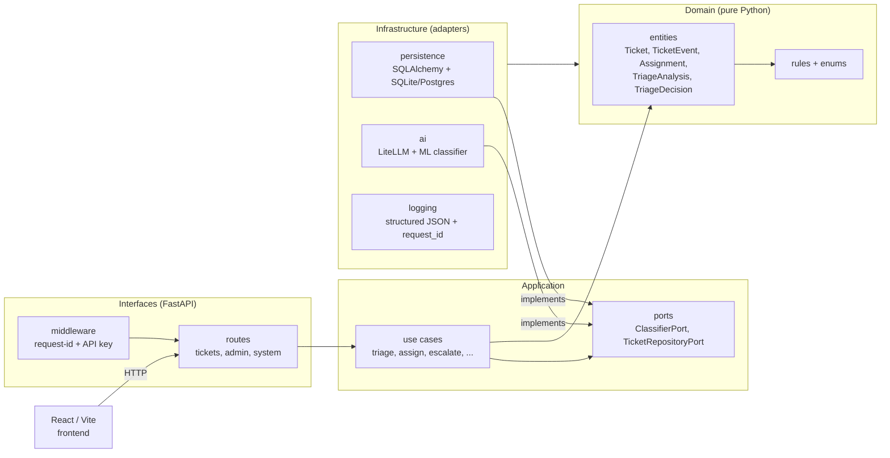

# AI-assisted Ticket Triage Platform

[](https://github.com/clavinci94/ai-assisted-ticket-triage-platform/actions/workflows/ci.yml)
[](https://github.com/clavinci94/ai-assisted-ticket-triage-platform/actions/workflows/release.yml)
[](https://github.com/clavinci94/ai-assisted-ticket-triage-platform/actions/workflows/cd.yml)
[](./pyproject.toml)
[](https://www.python.org/downloads/release/python-3110/)
[](https://nodejs.org/)
[](./LICENSE)

Modern ticket triage and operations dashboard for internal support teams. The project combines a FastAPI backend, a React/Vite frontend, AI-assisted ticket classification via LiteLLM, and a banking-style operator UI focused on review, assignment, SLA tracking, and reporting.

The current product state covers the full flow from ticket intake to AI recommendation, manual review, assignment, status handling, audit trail, workbench views, and reporting pages.

Agent- und Tool-Dokumentation: siehe **[AGENTS.md](./AGENTS.md)**.

## Highlights

- AI-assisted ticket intake with preview before persistence
- **Retrieval-augmented triage** — every LLM recommendation is grounded in the top-3 most similar previously-reviewed tickets, shown clickably in the UI (see [ADR 0004](./docs/adr/0004-retrieval-augmented-triage.md))
- Department recommendation with accept-or-override popup
- Ticket workbench with table views, filters, chips, pagination, and bulk actions
- Ticket detail workflow for review, assignment, status changes, escalation, and comments
- Reporting area for KPIs, departments, teams, SLA monitoring, backlog, and trend charts
- Local settings for operator name and preferred dashboard/reporting start points
- German-localized frontend tailored to internal bank, operations, and support processes

## Product Areas

### Ticket Intake

- Create new tickets from the dashboard
- Generate an AI recommendation before saving
- Show suggested department and rationale in a popup
- **Show the top-3 most similar historical tickets under each recommendation**, with their human-confirmed routing, so operators see *why* the AI is suggesting what it suggests
- Let the user accept the recommendation or override the department manually

### Operational Workbench

- `Alle Tickets`
- `Meine Tickets`
- `Offene Tickets`
- `Eskalationen`
- Search, sorting, multi-filtering, column visibility, pagination, row selection, and bulk actions

### Ticket Workflow

- Review AI triage decisions
- Assign a team and assignee
- Update ticket status
- Escalate high-risk tickets
- Add comments and internal notes
- Maintain an audit-style event timeline

### Reporting & Governance

- Dashboard overview with operational KPI blocks
- KPI reporting page
- Department analysis
- Team report
- SLA / due-date monitoring
- Ticket volume and backlog development charts
- Top assignee and processing-time metrics

## Tech Stack

### Backend

- Python
- FastAPI
- SQLAlchemy
- Pydantic
- scikit-learn (TF-IDF + NearestNeighbors for the retrieval-augmented triage layer)
- LiteLLM
- python-dotenv

### Frontend

- React
- Vite
- React Router
- Axios
- Recharts

### Persistence

- SQLite for local development (`triage.db`)

## Repository Structure

```text
.
├── app
│   ├── application
│   │   ├── dto
│   │   ├── ports
│   │   └── use_cases
│   ├── domain
│   │   ├── constants
│   │   ├── entities
│   │   ├── enums
│   │   └── rules
│   ├── infrastructure
│   │   ├── ai
│   │   ├── config
│   │   └── persistence
│   └── interfaces
│       └── api
│           ├── mappers
│           ├── routes
│           └── schemas
├── frontend
│   ├── src
│   │   ├── application
│   │   ├── domain
│   │   ├── infrastructure
│   │   └── interfaces
│   └── package.json
├── tests                    # pytest: unit / application / api
│   ├── api
│   ├── application
│   └── unit
├── e2e                      # Playwright end-to-end tests
│   ├── tests
│   └── playwright.config.js
├── scripts                  # operational helpers (seed, migrate)
├── data                     # training data (issues.csv)
├── docs/adr                 # architecture decision records (incl. 0004 RAG)
├── .github/workflows        # CI, Release, CD pipelines
├── AGENTS.md                # agent & tool documentation
├── Dockerfile               # multi-stage image (frontend + backend)
├── render.yaml              # Render deployment config
├── pyproject.toml           # pytest / ruff / coverage / bandit config
├── .pre-commit-config.yaml  # lint & security hooks for local commits
├── .env.example
├── dev.sh                   # local backend + frontend launcher
├── README.md
└── requirements.txt
```

## Architecture Layers



### Backend

- `domain`: entities, enums, business constants, and domain rules (**no framework imports**)
- `application`: use cases, DTOs, and abstract ports
- `infrastructure`: persistence, AI adapters, configuration, logging, technical services
- `interfaces`: HTTP routes, schemas, request mapping, middleware, and API composition

Every dependency arrow points inwards (Interfaces / Infrastructure → Application → Domain),
so swapping SQLite for Postgres or LiteLLM for a different backend never touches business logic.

See [`docs/adr/`](./docs/adr/) for the decisions behind this layering (Architecture Decision Records).

### Frontend

- `interfaces`: React pages and visual components
- `application`: UI workflows and workbench orchestration
- `domain`: frontend business constants and normalization helpers
- `infrastructure`: HTTP clients and browser storage adapters

## Current Frontend Navigation

- `Startseite`: explanation, usage guidance, and platform overview
- `Übersicht`: operator dashboard with KPI summaries and action areas
- `Alle Tickets`: central workbench table
- `Meine Tickets`: tickets assigned to the configured operator
- `Offene Tickets`: active open queue
- `Eskalationen`: high-priority and escalated tickets
- `Ticket erfassen`: ticket creation with AI preview popup
- `Reports`: reporting hub
- `KPIs`
- `Abteilungen`
- `Teams`
- `SLA / Fristen`
- `Einstellungen`

## API Overview

### Ticket Triage & Workflow

| Method | Endpoint | Description |
| --- | --- | --- |
| `POST` | `/tickets/triage` | Classic ML-based triage |
| `POST` | `/tickets/triage/llm` | Persist ticket with LiteLLM-backed triage |
| `POST` | `/tickets/triage/llm/preview` | Generate AI recommendation without saving |
| `POST` | `/tickets/decision` | Save review decision |
| `POST` | `/tickets/assign` | Assign team and assignee |
| `POST` | `/tickets/status` | Update ticket status |
| `POST` | `/tickets/comments` | Add comment or internal note |
| `POST` | `/tickets/escalate` | Escalate a ticket |

### Ticket Retrieval & Analytics

| Method | Endpoint | Description |
| --- | --- | --- |
| `GET` | `/tickets` | Return all ticket records |
| `GET` | `/tickets/workbench` | Filtered and paginated table data |
| `GET` | `/tickets/{ticket_id}` | Ticket details including analysis and events |
| `GET` | `/tickets/analytics` | Dashboard and reporting analytics |

### Other Endpoints

| Method | Endpoint | Description |
| --- | --- | --- |
| `POST` | `/admin/retrain` | Retrain the classic ML model |
| `POST` | `/admin/rebuild-rag` | Refit the retrieval index from the current reviewed-ticket corpus |
| `GET` | `/health` | Liveness probe (no dependencies) |
| `GET` | `/ready` | Readiness probe (verifies DB connectivity) |

Every response carries an `X-Request-ID` header; pass one in yourself to
propagate a correlation id across the stack (logs tag every line with it).

## Analytics Currently Exposed

The analytics endpoint now provides more than basic status counts. It includes:

- summary stats including total, open, triaged, reviewed, assigned, and closed
- category, priority, status, department, and team distribution
- SLA metrics
- processing time grouped by priority
- top assignees
- ticket volume over time
- backlog development over time

## Quick Start

### Prerequisites

- Python 3.11+
- Node.js 20+
- npm

### 1. Backend Setup

```bash
python3 -m venv .venv
source .venv/bin/activate
pip install -r requirements.txt
cp .env.example .env
uvicorn app.main:app --reload
```

Backend URLs:

- API: `http://127.0.0.1:8000`
- Swagger UI: `http://127.0.0.1:8000/docs`
- Health: `http://127.0.0.1:8000/health`

### 2. Frontend Setup

```bash
cd frontend
npm install
npm run dev
```

Frontend URL:

- App: `http://127.0.0.1:5173`

The frontend uses the backend on `http://127.0.0.1:8000` by default. If needed, provide `VITE_API_BASE_URL`.

### 3. One-Command Dev Start

After installing backend and frontend dependencies once, you can start both services from the repository root:

```bash
./dev.sh
```

Default URLs:

- Backend API: `http://127.0.0.1:8000`
- Frontend App: `http://127.0.0.1:5173`

Optional overrides:

```bash
BACKEND_PORT=8001 FRONTEND_PORT=5174 ./dev.sh
```

## Deploy on Render

This repository now includes a ready-to-use [render.yaml](./render.yaml) for:

- a FastAPI backend web service
- a React/Vite static frontend
- a Render Postgres database

Recommended setup:

1. Push the repository to GitHub.
2. In Render, create a new Blueprint and select this repository.
3. During setup, provide values for:
   - `LITELLM_API_BASE`
   - `LITELLM_API_KEY`
   - `VITE_API_BASE_URL`
4. For `VITE_API_BASE_URL`, use your backend Render URL, for example:
   - `https://ai-assisted-ticket-triage-api.onrender.com`
5. After the first deploy, open the frontend URL and verify that it can reach the backend.

Notes:

- The backend start command on Render is `uvicorn app.main:app --host 0.0.0.0 --port $PORT`.
- The backend accepts `DATABASE_URL`, which is used automatically by the included Render Postgres service.
- The frontend includes an SPA rewrite to `/index.html`, so React Router routes work on refresh.
- Render free Postgres is suitable for testing, but it has platform limitations and is not ideal for production workloads.

## Environment Variables

The preferred setup for this repository is LiteLLM proxy usage.

Example `.env`:

```env
LITELLM_API_BASE=https://your-litellm-proxy.example.com
LITELLM_API_KEY=sk-your-litellm-virtual-key
LITELLM_MODEL=azure_ai/gpt-oss-120b
```

### Supported Variables

| Variable | Purpose |
| --- | --- |
| `LITELLM_API_BASE` | LiteLLM proxy base URL |
| `LITELLM_API_KEY` | LiteLLM virtual key |
| `LITELLM_MODEL` | Model name for LLM triage |
| `OPENAI_BASE_URL` | Supported alias for the LiteLLM proxy base URL |
| `OPENAI_API_KEY` | Supported alias for the LiteLLM proxy key |
| `AZURE_API_BASE` | Optional direct Azure AI endpoint |
| `AZURE_API_KEY` | Optional direct Azure AI key |
| `DATABASE_URL` | Postgres/SQLite DSN (defaults to local `./triage.db`) |
| `API_KEY` | If set, every non-public request must send a matching `X-API-Key` header. Unset → auth disabled. |
| `LOG_LEVEL` | `DEBUG` / `INFO` / `WARNING`. Defaults to `INFO`. Logs are emitted as JSON lines. |
| `CORS_ALLOW_ORIGINS` | Comma-separated allow-list. Defaults to localhost dev ports. |
| `CORS_ALLOW_ORIGIN_REGEX` | Pattern used in production (e.g. `^https://.*\\.onrender\\.com$`). |

Notes:

- `.env.example` contains the recommended proxy-based template.
- Do not commit real credentials.
- `litellm_config.yaml` is only needed if you run your own local LiteLLM proxy.

## Development Notes

- The local SQLite database is created automatically as `triage.db`.
- Startup helpers add missing database columns for local schema evolution.
- The UI is currently localized in German.
- The workbench and settings area use local browser storage for operator preferences.
- Existing free-text ticket content is not automatically translated retroactively.

## Testing

The test pyramid covers three layers — all three run in CI on every push / PR.

### Backend (pytest)

Unit tests, application-layer tests, and API integration tests:

```bash
pytest                       # all tests
pytest tests/unit            # just unit tests
pytest --cov=app             # with coverage (fails under 75%)
```

Lint, format, and static security scan:

```bash
ruff check app tests
ruff format app tests
bandit -r app -c pyproject.toml
```

### Frontend (Vitest + Testing Library)

```bash
cd frontend
npm install
npm test                     # one-shot run (used in CI)
npm run test:watch           # watch mode
npm run test:coverage        # coverage report under frontend/coverage/
npm run lint                 # ESLint
npm run build                # production build
```

### End-to-End (Playwright)

The E2E suite spins up the backend (against a disposable SQLite file) and the Vite
dev server, then drives them with Chromium.

```bash
cd e2e
npm install
npm run install-browsers     # one-time: fetch Chromium
npm test
```

See [`e2e/README.md`](./e2e/README.md) for configuration details (ports,
env vars, report locations).

## CI / CD

| Workflow | Trigger | Purpose |
| --- | --- | --- |
| [`ci.yml`](./.github/workflows/ci.yml) | push / PR on `main` | ruff + pytest (75 % coverage gate) + Vitest + ESLint + Vite build + Playwright E2E + bandit + pip-audit + npm audit |
| [`release.yml`](./.github/workflows/release.yml) | git tag `v*.*.*` | Build Docker image, push to GHCR, create GitHub Release |
| [`cd.yml`](./.github/workflows/cd.yml) | successful CI on `main` | Trigger Render deploy hooks for API + frontend |

[Dependabot](./.github/dependabot.yml) opens weekly PRs for Python, npm,
GitHub Actions, and Docker base-image updates. A local
[pre-commit config](./.pre-commit-config.yaml) runs ruff, bandit, gitleaks,
and generic hygiene hooks on every commit — install once with
`pip install pre-commit && pre-commit install`.

### Required GitHub secrets (for CD)

| Secret | Required by | Source |
| --- | --- | --- |
| `RENDER_DEPLOY_HOOK_API` | `cd.yml` | Render Dashboard → Backend service → Deploy Hook |
| `RENDER_DEPLOY_HOOK_FRONTEND` | `cd.yml` | Render Dashboard → Static Site → Deploy Hook |

GHCR pushes use the default `GITHUB_TOKEN`; no extra secret is needed.

## Docker

A multi-stage [`Dockerfile`](./Dockerfile) builds the React frontend and packages
it alongside the FastAPI backend in a single `python:3.11-slim` runtime image
(non-root user, healthcheck on `/health`).

```bash
docker build -t ticket-triage:local .
docker run --rm -p 8000:8000 \
  -e DATABASE_URL=sqlite:///./triage.db \
  -e LITELLM_API_BASE=... \
  -e LITELLM_API_KEY=... \
  ticket-triage:local
```

Published images (on tagged releases): `ghcr.io/clavinci94/ai-assisted-ticket-triage-platform:<version>`.

```bash
docker pull ghcr.io/clavinci94/ai-assisted-ticket-triage-platform:latest
```

## Retrieval-Augmented Triage (RAG)

Every LLM recommendation is enriched with the **three most similar past
tickets that a human reviewer has confirmed**. The UI shows them as
clickable references under the AI's suggested department, so the operator
sees concrete precedent — not just prose — for the routing decision.

### How it works

```
new ticket
   │
   ▼
RagAssistedClassifier      (decorator, app/infrastructure/ai/rag_assisted_classifier.py)
   │  ├── SimilarTicketsPort   (→ TfidfSimilarTicketsAdapter — scikit-learn)
   │  │     └── picks top-3 reviewed tickets, ranked by cosine similarity
   │  │
   │  └── inner ClassifierPort (→ LitellmClassifier, with the retrieved
   │        examples injected as an extra system message before the prompt)
   │
   ▼
TriageAnalysis (with similar_cases populated and returned to the UI)
```

### Corpus

Only tickets with `reviewed_by IS NOT NULL` count — meaning the retrieval
layer learns **exclusively from human-confirmed routing decisions**, never
from historical AI guesses.

### Demo data

For an empty database, seed ~20 realistic reviewed tickets:

```bash
.venv/bin/python scripts/seed_demo_tickets.py            # add, skip duplicates
.venv/bin/python scripts/seed_demo_tickets.py --replace  # wipe DEMO-* first
```

Then rebuild the retrieval index so newly seeded tickets are picked up
without restarting the server:

```bash
curl -X POST http://127.0.0.1:8000/admin/rebuild-rag
```

### Rationale

Full context and the rejected alternatives (sentence-transformers,
pgvector, agent loops) are in [ADR 0004](./docs/adr/0004-retrieval-augmented-triage.md).

### SQLite to Render/Postgres Migration

To copy your local `triage.db` into another database such as Render Postgres, run:

```bash
DATABASE_URL="your-render-internal-database-url" .venv/bin/python scripts/migrate_sqlite_to_database.py
```

Optional full replace of the target data:

```bash
DATABASE_URL="your-render-internal-database-url" .venv/bin/python scripts/migrate_sqlite_to_database.py --replace
```

If you run the migration from your local machine into Render Postgres, use the Render `External Database URL`.
The `Internal Database URL` only works from services running inside Render.

## License

Released under the MIT License — see [LICENSE](./LICENSE).
