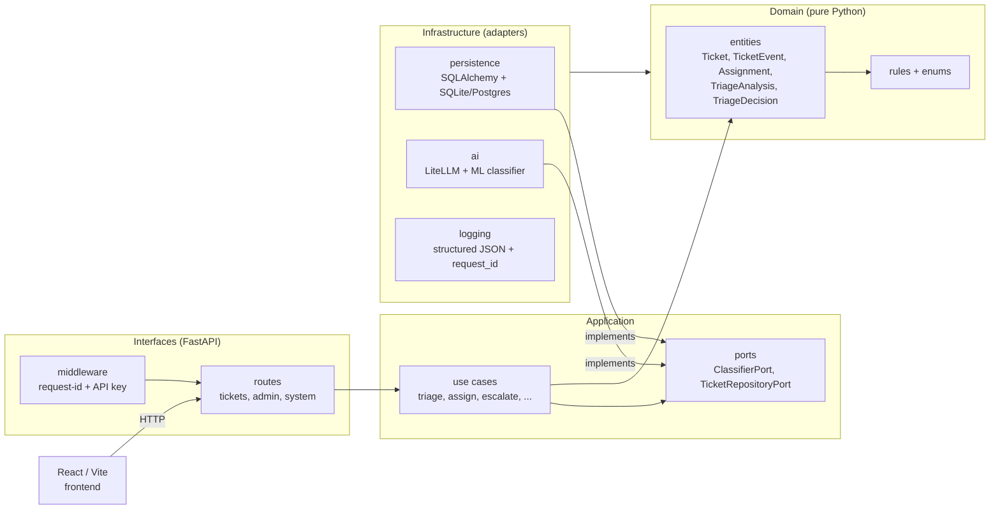

# AI-Assisted Ticket Triage Platform

[](https://github.com/clavinci94/ai-assisted-ticket-triage-platform/actions/workflows/ci.yml)
[](https://github.com/clavinci94/ai-assisted-ticket-triage-platform/actions/workflows/release.yml)
[](https://github.com/clavinci94/ai-assisted-ticket-triage-platform/actions/workflows/cd.yml)
[](./pyproject.toml)
[](https://www.python.org/downloads/release/python-3110/)
[](https://nodejs.org/)
[](./LICENSE)

> A production-grade ticket triage platform that combines an LLM with retrieval over **human-confirmed past decisions** — so every routing suggestion is grounded in real precedent, not just prose.

A FastAPI backend, a React/Vite operator UI, and an AI layer that turns unstructured incoming tickets into reviewed, assigned, and reportable work — with a banking-style workbench for review, SLA tracking, and analytics.

---

## Demo

**[Try the live demo →](https://ai-assisted-ticket-triage-frontend.onrender.com/)**

> Hosted on Render's free tier — the first request after inactivity may take 30–60 s to wake the backend.

### AI-assisted intake with retrieval-grounded recommendations


The operator sees the AI's suggested department, its reasoning, **and the most similar past tickets that a human reviewer has already routed** — with a similarity score. Accept, override, or cancel before anything is saved.

### Operations dashboard


Live KPIs (total / open / critical / triaged / reviewed / active departments) plus three operational queues: critical tickets, review queue, latest tickets.

### Reporting & analytics


Ticket volume over time, backlog development, processing time by priority, top assignees, and active teams — with 7/30/90-day filtering.

### Operator workbench


Filter by status, priority, department, and source. Sort by any column. Bulk actions, pagination, column visibility — built for daily ticket review work.

---

## Why this exists

Internal support teams drown in unstructured tickets. Most "AI triage" tools either ignore historical context or hide their reasoning. This platform takes a different approach:

1. **Every AI recommendation is grounded** in the three most similar past tickets that a human has already routed.
2. **The operator stays in control** — the AI suggests, the human accepts or overrides, and that decision becomes new training data for retrieval.
3. **It's production-grade out of the box** — clean architecture, full CI/CD, security scans, three test layers, Docker image, deploy-ready for Render.

The result is a system that gets better the more it's used, without ever asking a human to trust a black box.

---

## Highlights

- **Retrieval-augmented triage** — every LLM call is enriched with the top-3 most similar previously-reviewed tickets, shown clickably under each suggestion ([ADR 0004](./docs/adr/0004-retrieval-augmented-triage.md))
- **AI preview before persistence** — operators see and can override the suggested department before anything is saved
- **Operator workbench** — table views, filters, chips, pagination, bulk actions, plus a full ticket-detail workflow with assignment, status, escalation, comments, and audit trail
- **Reporting hub** — KPI summaries, department and team analysis, SLA monitoring, backlog development, top-assignee and processing-time metrics
- **Hexagonal architecture** — domain layer is pure Python with no framework imports; SQLite, Postgres, and the LLM are all swappable adapters
- **Full CI/CD** — ruff + pytest (75% gate) + Vitest + ESLint + Vite build + Playwright E2E + bandit + pip-audit + npm audit, all on every push
- **Operational essentials** — health and readiness probes, structured JSON logging with `X-Request-ID` correlation, optional API-key auth, multi-stage Docker, Render blueprint
- **German-localized frontend** for internal Swiss bank/operations contexts

---

## How a ticket flows through the system

```
new ticket
   │
   ▼
RagAssistedClassifier            (app/infrastructure/ai/rag_assisted_classifier.py)
   │
   ├── SimilarTicketsPort        → TfidfSimilarTicketsAdapter (scikit-learn)
   │     └── top-3 reviewed tickets ranked by cosine similarity
   │
   └── ClassifierPort            → LitellmClassifier
         └── retrieved examples injected as extra system context before the prompt
   │
   ▼
TriageAnalysis (with similar_cases) → operator preview popup
   │
   ▼
operator accepts or overrides → ticket saved, audit event written
```

**Corpus rule:** only tickets with `reviewed_by IS NOT NULL` are retrievable. The retrieval layer learns **exclusively from human-confirmed routing**, never from historical AI guesses. Full rationale and rejected alternatives (sentence-transformers, pgvector, agent loops) live in [ADR 0004](./docs/adr/0004-retrieval-augmented-triage.md).

---

## Architecture


```mermaid
flowchart LR
    UI["React / Vite<br/>frontend"]

    subgraph Interfaces["Interfaces (FastAPI)"]
        Routes["routes<br/>tickets, admin, system"]
        Middleware["middleware<br/>request-id + API key"]
    end

    subgraph Application["Application"]
        UseCases["use cases<br/>triage, assign, escalate, ..."]
        Ports["ports<br/>ClassifierPort, TicketRepositoryPort"]
    end

    subgraph Domain["Domain (pure Python)"]
        Entities["entities<br/>Ticket, TicketEvent, Assignment,<br/>TriageAnalysis, TriageDecision"]
        Rules["rules + enums"]
    end

    subgraph Infrastructure["Infrastructure (adapters)"]
        Persistence["persistence<br/>SQLAlchemy + SQLite/Postgres"]
        AI["ai<br/>LiteLLM + ML classifier"]
        Logging["logging<br/>structured JSON + request_id"]
    end

    UI -->|HTTP| Routes
    Middleware --> Routes
    Routes --> UseCases
    UseCases --> Ports
    UseCases --> Entities
    Persistence -->|implements| Ports
    AI -->|implements| Ports
    Entities --> Rules
    Infrastructure --> Domain
```

Every dependency arrow points inward (Interfaces / Infrastructure → Application → Domain), so swapping SQLite for Postgres or LiteLLM for a different backend never touches business logic.

**Backend layers:**
- `domain` — entities, enums, business constants, domain rules (no framework imports)
- `application` — use cases, DTOs, abstract ports
- `infrastructure` — persistence, AI adapters, configuration, logging
- `interfaces` — HTTP routes, schemas, middleware, API composition

**Frontend layers:** mirror the backend (`interfaces` / `application` / `domain` / `infrastructure`).

Architectural decisions are documented as ADRs in [`docs/adr/`](./docs/adr/).

---

## Tech Stack

| Layer | Tools |
| --- | --- |
| Backend | Python 3.11, FastAPI, SQLAlchemy, Pydantic, scikit-learn (TF-IDF + NearestNeighbors), LiteLLM |
| Frontend | React, Vite, React Router, Axios, Recharts |
| Persistence | SQLite (dev), Postgres (prod, via Render) |
| Quality | pytest + coverage, ruff, bandit, pip-audit, Vitest + Testing Library, ESLint, Playwright, gitleaks, pre-commit |
| Delivery | Multi-stage Docker, GHCR, Render blueprint, Dependabot |

Agent and tool documentation: [AGENTS.md](./AGENTS.md).

---

## Quick Start

### Prerequisites
- Python 3.11+
- Node.js 20+
- npm

### One-command dev start

After installing backend and frontend dependencies once:

```bash
./dev.sh
```

- Backend: `http://127.0.0.1:8000` (Swagger at `/docs`)
- Frontend: `http://127.0.0.1:5173`

### Step-by-step

```bash
# Backend
python3 -m venv .venv
source .venv/bin/activate
pip install -r requirements.txt
cp .env.example .env
uvicorn app.main:app --reload

# Frontend (in a second terminal)
cd frontend
npm install
npm run dev
```

The frontend uses the backend on `http://127.0.0.1:8000` by default. Override with `VITE_API_BASE_URL` if needed.

### Seed demo data

For an empty database, seed ~20 realistic reviewed tickets so the retrieval layer has something to work with:

```bash
.venv/bin/python scripts/seed_demo_tickets.py            # add, skip duplicates
.venv/bin/python scripts/seed_demo_tickets.py --replace  # wipe DEMO-* first
curl -X POST http://127.0.0.1:8000/admin/rebuild-rag     # rebuild retrieval index
```

---

## Frontend Navigation

| Section | Purpose |
| --- | --- |
| `Startseite` | Platform overview and usage guidance |
| `Übersicht` | Operator dashboard with KPI summaries |
| `Alle Tickets` | Central workbench table |
| `Meine Tickets` | Tickets assigned to the configured operator |
| `Offene Tickets` | Active open queue |
| `Eskalationen` | High-priority and escalated tickets |
| `Ticket erfassen` | Ticket creation with AI preview popup |
| `Reports` | Reporting hub (KPIs, departments, teams, SLA) |
| `Einstellungen` | Operator name and dashboard preferences (local browser storage) |

---

## API Reference

### Triage & Workflow

| Method | Endpoint | Description |
| --- | --- | --- |
| `POST` | `/tickets/triage` | Classic ML-based triage |
| `POST` | `/tickets/triage/llm` | Persist ticket with LiteLLM-backed triage |
| `POST` | `/tickets/triage/llm/preview` | Generate AI recommendation without saving |
| `POST` | `/tickets/decision` | Save review decision |
| `POST` | `/tickets/assign` | Assign team and assignee |
| `POST` | `/tickets/status` | Update ticket status |
| `POST` | `/tickets/comments` | Add comment or internal note |
| `POST` | `/tickets/escalate` | Escalate a ticket |

### Retrieval & Analytics

| Method | Endpoint | Description |
| --- | --- | --- |
| `GET` | `/tickets` | All ticket records |
| `GET` | `/tickets/workbench` | Filtered, paginated table data |
| `GET` | `/tickets/{ticket_id}` | Ticket details, analysis, events |
| `GET` | `/tickets/analytics` | Dashboard and reporting analytics |

### Operations

| Method | Endpoint | Description |
| --- | --- | --- |
| `POST` | `/admin/retrain` | Retrain the classic ML model |
| `POST` | `/admin/rebuild-rag` | Refit the retrieval index from current reviewed tickets |
| `GET` | `/health` | Liveness probe |
| `GET` | `/ready` | Readiness probe (verifies DB connectivity) |

Every response carries an `X-Request-ID` header. Pass one in yourself to propagate a correlation ID across the stack — every log line is tagged with it.

**Analytics returned:** total / open / triaged / reviewed / assigned / closed counts, category and priority distribution, status and department breakdowns, SLA metrics, processing time per priority, top assignees, ticket volume over time, backlog development.

---

## Quality & Testing

A three-layer test pyramid that runs on every push and PR.

### Backend (pytest)

```bash
pytest                       # all tests
pytest tests/unit            # unit only
pytest --cov=app             # with coverage (fails under 75%)

ruff check app tests
ruff format app tests
bandit -r app -c pyproject.toml
```

### Frontend (Vitest + Testing Library)

```bash
cd frontend
npm test                     # one-shot run (CI)
npm run test:watch
npm run test:coverage
npm run lint
npm run build
```

### End-to-end (Playwright)

Spins up the backend (against a disposable SQLite file) and the Vite dev server, drives them with Chromium.

```bash
cd e2e
npm install
npm run install-browsers     # one-time
npm test
```

See [`e2e/README.md`](./e2e/README.md) for ports, env vars, and report locations.

---

## CI / CD

| Workflow | Trigger | What it does |
| --- | --- | --- |
| [`ci.yml`](./.github/workflows/ci.yml) | push / PR on `main` | ruff + pytest (75% gate) + Vitest + ESLint + Vite build + Playwright + bandit + pip-audit + npm audit |
| [`release.yml`](./.github/workflows/release.yml) | git tag `v*.*.*` | Build Docker image, push to GHCR, create GitHub Release |
| [`cd.yml`](./.github/workflows/cd.yml) | successful CI on `main` | Trigger Render deploy hooks for API + frontend |

[Dependabot](./.github/dependabot.yml) opens weekly PRs for Python, npm, GitHub Actions, and Docker base-image updates. The local [pre-commit config](./.pre-commit-config.yaml) runs ruff, bandit, gitleaks, and hygiene hooks on every commit — install once with `pip install pre-commit && pre-commit install`.

### Required GitHub secrets (for CD)

| Secret | Used by | Source |
| --- | --- | --- |
| `RENDER_DEPLOY_HOOK_API` | `cd.yml` | Render Dashboard → Backend service → Deploy Hook |
| `RENDER_DEPLOY_HOOK_FRONTEND` | `cd.yml` | Render Dashboard → Static Site → Deploy Hook |

GHCR pushes use the default `GITHUB_TOKEN`; no extra secret needed.

---

## Deploy

### On Render 

This repo includes a ready-to-use [`render.yaml`](./render.yaml) for a FastAPI backend, a static React frontend, and a Render Postgres database.

1. Push to GitHub
2. In Render → New Blueprint → select this repo
3. Provide values for `LITELLM_API_BASE`, `LITELLM_API_KEY`, `VITE_API_BASE_URL`
4. For `VITE_API_BASE_URL`, use your backend Render URL (e.g. `https://ai-assisted-ticket-triage-api.onrender.com`)
5. Open the frontend URL after first deploy and verify it reaches the backend

The backend uses `DATABASE_URL` automatically from the included Postgres service. The frontend has SPA rewrites to `/index.html` so React Router routes survive a refresh.

### With Docker

A multi-stage [`Dockerfile`](./Dockerfile) builds the React frontend and packages it alongside the FastAPI backend in a single `python:3.11-slim` image (non-root user, healthcheck on `/health`).

```bash
docker build -t ticket-triage:local .
docker run --rm -p 8000:8000 \
  -e DATABASE_URL=sqlite:///./triage.db \
  -e LITELLM_API_BASE=... \
  -e LITELLM_API_KEY=... \
  ticket-triage:local

# Or pull a published image from a tagged release:
docker pull ghcr.io/clavinci94/ai-assisted-ticket-triage-platform:latest
```

### Migrating local SQLite to Render Postgres

```bash
DATABASE_URL="your-render-external-database-url" \
  .venv/bin/python scripts/migrate_sqlite_to_database.py

# Optional full replace of the target data:
DATABASE_URL="your-render-external-database-url" \
  .venv/bin/python scripts/migrate_sqlite_to_database.py --replace
```

Use the Render **External Database URL** when running the migration from your local machine. The Internal URL only works from services running inside Render.

---

## Environment Variables

The preferred setup is a LiteLLM proxy. Example `.env`:

```env
LITELLM_API_BASE=https://your-litellm-proxy.example.com
LITELLM_API_KEY=sk-your-litellm-virtual-key
LITELLM_MODEL=azure_ai/gpt-oss-120b
```

| Variable | Purpose |
| --- | --- |
| `LITELLM_API_BASE` | LiteLLM proxy base URL |
| `LITELLM_API_KEY` | LiteLLM virtual key |
| `LITELLM_MODEL` | Model name for LLM triage |
| `OPENAI_BASE_URL` / `OPENAI_API_KEY` | Aliases for the LiteLLM proxy |
| `AZURE_API_BASE` / `AZURE_API_KEY` | Optional direct Azure AI endpoint |
| `DATABASE_URL` | Postgres/SQLite DSN (defaults to `./triage.db`) |
| `API_KEY` | If set, every non-public request must send a matching `X-API-Key` header |
| `LOG_LEVEL` | `DEBUG` / `INFO` / `WARNING`. JSON-line output. |
| `CORS_ALLOW_ORIGINS` | Comma-separated allow-list (defaults to localhost dev ports) |
| `CORS_ALLOW_ORIGIN_REGEX` | Pattern for production (e.g. `^https://.*\\.onrender\\.com$`) |

`.env.example` ships the recommended proxy template. `litellm_config.yaml` is only needed if you run your own local LiteLLM proxy.

---

## Repository Structure

```text
.
├── app
│   ├── application       # use cases, DTOs, ports
│   ├── domain            # entities, enums, rules — pure Python
│   ├── infrastructure    # persistence, AI adapters, config
│   └── interfaces        # FastAPI routes, schemas, middleware
├── frontend              # React / Vite UI (mirrors backend layering)
├── tests                 # pytest: unit / application / api
├── e2e                   # Playwright end-to-end tests
├── scripts               # seed, migrate, ops helpers
├── data                  # training data (issues.csv)
├── docs/adr              # architecture decision records
├── .github/workflows     # CI, Release, CD pipelines
├── AGENTS.md             # agent & tool documentation
├── Dockerfile            # multi-stage image
├── render.yaml           # Render deployment config
├── pyproject.toml        # pytest / ruff / coverage / bandit
├── .pre-commit-config.yaml
└── dev.sh                # local backend + frontend launcher
```

---

## What I learned building this

Three things I'd carry into the next project:

1. **Retrieval beats prompt-only every time.** The first version was a single LLM call with a long instruction prompt. It worked, but inconsistently. Adding a TF-IDF retrieval layer over reviewed tickets — even a simple one — improved consistency more than any prompt-engineering iteration.
2. **Hexagonal architecture pays off the moment you switch a backend.** Moving from SQLite to Postgres for the Render deploy was a single environment variable. Swapping LiteLLM for a different provider would touch one file. The discipline up front saved hours later.
3. **CI quality gates are the cheapest insurance you can buy.** A 75% coverage floor, ruff in pre-commit, and bandit + pip-audit + npm audit on every PR have already caught regressions and a vulnerable dependency before they hit `main`.

What I'd do differently next time: start with Pydantic-validated structured outputs from day one (instead of parsing JSON strings), and write the eval set before the first production prompt rather than after.

---

## Roadmap

- [ ] Multilingual ticket support (current corpus is German)
- [ ] Replace TF-IDF with sentence-transformers embeddings + pgvector once the corpus crosses a few thousand reviewed tickets
- [ ] Per-team SLA targets in reporting
- [ ] Webhook outbound integration (Slack / Teams) for escalations

---

## License

Released under the MIT License — see [LICENSE](./LICENSE).
