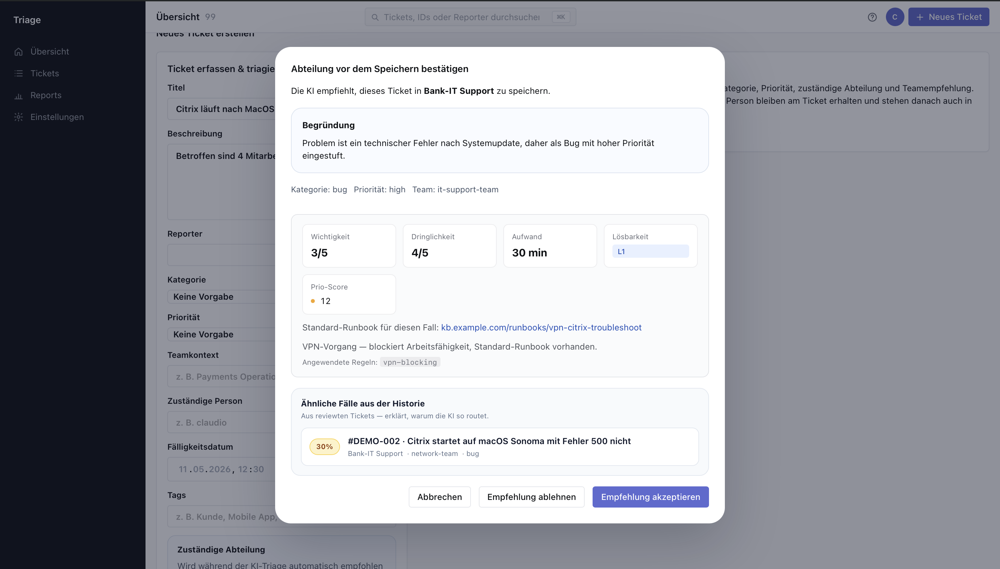
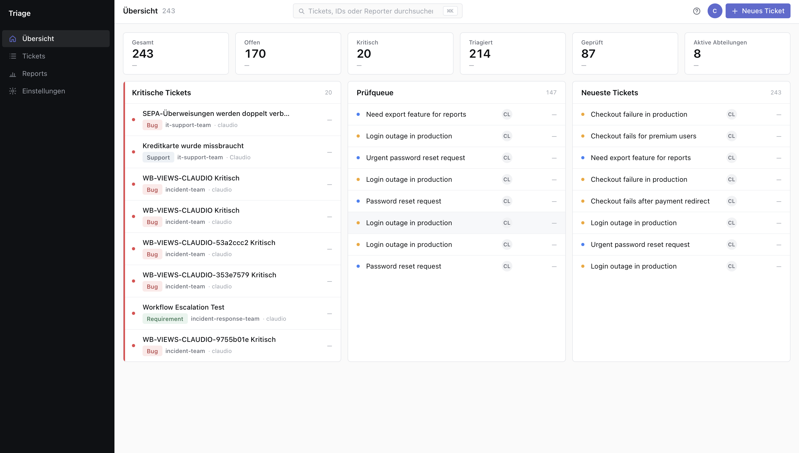
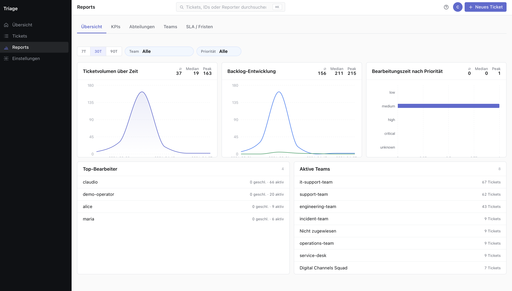
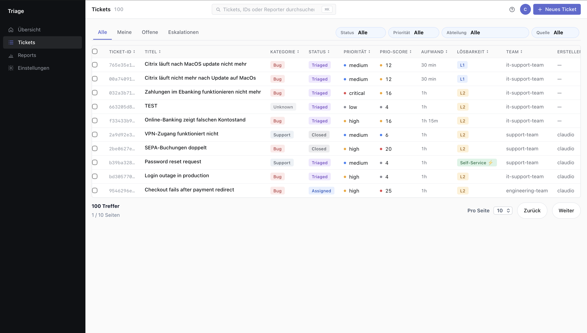
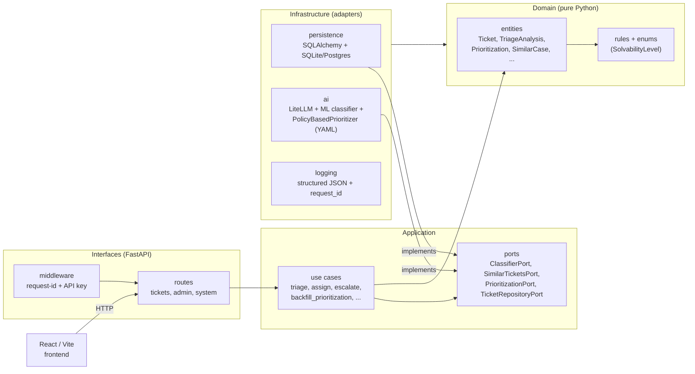

# AI-Assisted Ticket Triage Platform

[](https://github.com/clavinci94/ai-assisted-ticket-triage-platform/actions/workflows/ci.yml)
[](https://github.com/clavinci94/ai-assisted-ticket-triage-platform/actions/workflows/release.yml)
[](https://github.com/clavinci94/ai-assisted-ticket-triage-platform/actions/workflows/cd.yml)
[](./pyproject.toml)
[](https://www.python.org/downloads/release/python-3110/)
[](https://nodejs.org/)
[](./LICENSE)

> A production-grade ticket triage platform that combines an LLM with **retrieval over human-confirmed past decisions** and a **knowledge-engineered prioritization layer** — so every routing suggestion is grounded in real precedent and every ticket arrives at the workbench with an estimated effort, a priority score, and a solvability hint.

A FastAPI backend, a React/Vite operator UI, and an AI layer that turns unstructured incoming tickets into reviewed, assigned, prioritized, and reportable work — with a banking-style workbench for review, SLA tracking, and analytics.

---

## Demo

**[Try the live demo →](https://ai-assisted-ticket-triage-frontend.onrender.com/)**

> Hosted on Render's free tier — the first request after inactivity may take 30–60 s to wake the backend.

### AI-assisted intake with retrieval-grounded recommendations



The operator sees the AI's suggested department, its reasoning, **and the most similar past tickets that a human reviewer has already routed** — with a similarity score. The modal also surfaces the Knowledge-Engineering prioritization (Wichtigkeit, Dringlichkeit, Aufwand, Lösbarkeit, Prio-Score) and — for self-service-eligible cases — a runbook link the operator can hand to the reporter directly. Accept, override, or cancel before anything is saved.

### Operations dashboard



Live KPIs (total / open / critical / triaged / reviewed / active departments) plus three operational queues: critical tickets, review queue, latest tickets.

### Reporting & analytics



Ticket volume over time, backlog development, processing time by priority, top assignees, and active teams — with 7/30/90-day filtering. A dedicated **Priorisierung & Aufwand** section adds KPI tiles (tickets bewertet, Self-Service-Quote, Auto-Resolve-Treffer, Ø Aufwand, Gesamtaufwand) and three distribution charts (Prio-Score buckets, Aufwand buckets, Lösbarkeit).

### Operator workbench



Filter by status, priority, department, and source. Sort by any column. Bulk actions, pagination, column visibility — built for daily ticket review work. New columns: **Prio-Score** (Wichtigkeit × Dringlichkeit), **Aufwand**, **Lösbarkeit** — sort the backlog by what actually matters operationally.

---

## Why this exists

Internal support teams drown in unstructured tickets. Most "AI triage" tools either ignore historical context, hide their reasoning, or stop at category prediction without saying anything about how urgent, how expensive, or how solvable a ticket really is. This platform takes a different approach:

1. **Every AI recommendation is grounded** in the three most similar past tickets that a human has already routed.
2. **Every ticket gets a knowledge-engineered prioritization** — a structured score across four operational dimensions (importance, urgency, effort, solvability) derived from a transparent YAML rule set plus retrieval-based effort estimates from past resolutions.
3. **The operator stays in control** — the AI suggests, the human accepts or overrides, and that decision becomes new training data for retrieval.
4. **It's production-grade out of the box** — clean architecture, full CI/CD, security scans, three test layers, Docker image, deploy-ready for Render.

The result is a system that gets better the more it's used, surfaces self-service opportunities early, and never asks a human to trust a black box.

---

## Highlights

- **Retrieval-augmented triage** — every LLM call is enriched with the top-3 most similar previously-reviewed tickets, shown clickably under each suggestion ([ADR 0004](./docs/adr/0004-retrieval-augmented-triage.md))
- **Knowledge-engineered prioritization** — every ticket arrives at the operator with a structured score across four dimensions and a derived Prio-Score (1–25). Self-service cases are surfaced with a runbook link before a human picks them up ([details below](#knowledge-engineered-prioritization))
- **AI preview before persistence** — operators see and can override the suggested department before anything is saved
- **Operator workbench** — table views, filters, chips, pagination, bulk actions, plus a full ticket-detail workflow with assignment, status, escalation, comments, and audit trail
- **Reporting hub** — KPI summaries, department and team analysis, SLA monitoring, backlog development, top-assignee and processing-time metrics — plus a dedicated KE-prioritization analytics block
- **Hexagonal architecture** — domain layer is pure Python with no framework imports; SQLite, Postgres, the LLM, and the prioritization policy are all swappable adapters
- **Full CI/CD** — ruff + pytest (75% gate) + Vitest + ESLint + Vite build + Playwright E2E + bandit + pip-audit + npm audit, all on every push
- **Operational essentials** — health and readiness probes, structured JSON logging with `X-Request-ID` correlation, optional API-key auth, optional outbound escalation notifications (Discord webhook, [ADR 0005](./docs/adr/0005-outbound-escalation-notifications.md)), multi-stage Docker, Render blueprint
- **German-localized frontend** for internal Swiss bank/operations contexts

---

## How a ticket flows through the system

```
new ticket
   │
   ▼
TriageTicketUseCase                 (app/application/use_cases/triage_ticket.py)
   │
   ├── ClassifierPort               → MLClassifier (TF-IDF + Naive Bayes)
   │                                  or RagAssistedClassifier → LitellmClassifier
   │     └── retrieved examples injected as extra system context before the prompt
   │
   ├── SimilarTicketsPort           → TfidfSimilarTicketsAdapter (scikit-learn)
   │     └── top-3 reviewed tickets ranked by cosine similarity
   │
   └── PrioritizationPort           → PolicyBasedPrioritizer (YAML rule set)
         ├── matches Impact / Urgency / Solvability / Runbook
         └── averages effort_estimate_minutes across RAG neighbours
   │
   ▼
TriageAnalysis + Prioritization → operator preview popup
   │
   ▼
operator accepts or overrides → ticket persisted with audit trail
```

**Corpus rule:** only tickets with `reviewed_by IS NOT NULL` are retrievable. The retrieval layer learns **exclusively from human-confirmed routing**, never from historical AI guesses. Full rationale and rejected alternatives (sentence-transformers, pgvector, agent loops) live in [ADR 0004](./docs/adr/0004-retrieval-augmented-triage.md).

---

## Knowledge-engineered prioritization

The classifier tells you *what kind* of ticket this is. The prioritizer tells you *what to do with it.* It runs after the classifier on every triage call and answers four operational questions in a single, explainable pass:

| Dimension | Answers | How it's computed |
|---|---|---|
| **Wichtigkeit** (Impact, 1–5) | "How much does this matter to the business?" | YAML rule match on tags / department / AI category |
| **Dringlichkeit** (Urgency, 1–5) | "How fast must we react?" | YAML rule match — same evaluator |
| **Aufwand** (Effort, minutes) | "How expensive will this be?" | Mean `effort_estimate_minutes` of the top-k similar reviewed tickets (RAG), with a YAML fallback |
| **Lösbarkeit** (Solvability) | "Self-Service · L1 · L2 · Spezialist — who needs to look at this?" | YAML rule match |

Two derived signals drive UI behaviour:

- **Prio-Score** = `Wichtigkeit × Dringlichkeit` (1–25). Sorts the backlog. AML at impact 5 × urgency 5 = 25 outranks a printer issue at 2 × 2 = 4.
- **Auto-Resolve-Eligible** = `solvability == self-service` ∧ `category_confidence ≥ threshold`. When both are true, the modal surfaces a runbook URL the operator can paste back to the reporter instead of opening a queue slot.

### The policy is a YAML file

Domain knowledge lives in [`app/infrastructure/triage_policy.yaml`](./app/infrastructure/triage_policy.yaml), not buried in code. Rules look like:

```yaml
self_service_confidence_threshold: 0.6
default_effort_minutes: 60

rules:
  - id: aml-critical
    match: { tags_any: [aml, sanctions, kyc, compliance] }
    set:
      impact_score: 5
      urgency_score: 5
      solvability: specialist
      rationale: "Compliance-/AML-Vorgang — regulatorisches Risiko, sofortige Eskalation."

  - id: password-self-service
    match:
      tags_any: [password]
      title_any: [passwort, reset, lockout]
    set:
      impact_score: 2
      urgency_score: 3
      solvability: self-service
      runbook_url: "https://selfservice.example.com/password-reset"
      rationale: "Passwort-/Account-Reset — über Self-Service-Portal abdeckbar."

default:
  impact_score: 3
  urgency_score: 3
  solvability: l2
```

A compliance officer can read it. So can the model. Adding a new rule means editing one file and restarting the service — no code change.

### Why this layout

1. **Explainable** — the prioritizer reports which rule IDs matched (`matched_rules`) and concatenates their rationales. Operators see exactly *why* a ticket scored what it did.
2. **Cheap to evolve** — new business policies (e.g. new regulator, new product line) are config changes.
3. **Learns from history** — effort is not invented in YAML, it's *averaged from real past resolutions* via the RAG layer. Add 50 new resolved VPN tickets, and the next VPN ticket's effort estimate sharpens automatically.
4. **Surfaces the cheap wins** — by flagging self-service cases at intake, the demo's 11 self-service-eligible tickets (12% of the corpus) can be handed straight back to the reporter via runbook URL — measurable hours saved.

### Operations: seeding & backfill

- `POST /admin/seed-demo` populates the database with 20 curated demo tickets + 60 historical tickets, each prioritized at seed time so the workbench has data on day one.
- `POST /admin/backfill-prioritization` re-runs the prioritizer over every ticket where `impact_score IS NULL` — useful after upgrading from a pre-KE version, or after a major policy change. Idempotent: re-running on a fully-prioritized DB does nothing.

### Reporting

The Reports page surfaces the KE layer with:

- **KPI tiles**: tickets prioritized · self-service share · auto-resolve hits · average effort · total backlog effort
- **Prio-Score distribution** (Niedrig 1–5 / Mittel 6–11 / Hoch 12–19 / Kritisch 20–25)
- **Aufwand distribution** (< 15 min / 15–60 min / 1–2 h / 2–4 h / > 4 h)
- **Lösbarkeit distribution** (Self-Service / L1 / L2 / Spezialist)

These let an ops lead answer questions like *"how much of next week's backlog is actually self-service?"* or *"are we drowning in 4h+ tickets or in 30-minute ones?"* with a glance.

---

## Architecture


```mermaid
flowchart LR
    UI["React / Vite<br/>frontend"]

    subgraph Interfaces["Interfaces (FastAPI)"]
        Routes["routes<br/>tickets, admin, system"]
        Middleware["middleware<br/>request-id + API key"]
    end

    subgraph Application["Application"]
        UseCases["use cases<br/>triage, assign, escalate,<br/>backfill_prioritization, ..."]
        Ports["ports<br/>ClassifierPort, SimilarTicketsPort,<br/>PrioritizationPort, TicketRepositoryPort"]
    end

    subgraph Domain["Domain (pure Python)"]
        Entities["entities<br/>Ticket, TriageAnalysis,<br/>Prioritization, SimilarCase, ..."]
        Rules["rules + enums<br/>(SolvabilityLevel)"]
    end

    subgraph Infrastructure["Infrastructure (adapters)"]
        Persistence["persistence<br/>SQLAlchemy + SQLite/Postgres"]
        AI["ai<br/>LiteLLM + ML classifier +<br/>PolicyBasedPrioritizer (YAML)"]
        Logging["logging<br/>structured JSON + request_id"]
    end

    UI -->|HTTP| Routes
    Middleware --> Routes
    Routes --> UseCases
    UseCases --> Ports
    UseCases --> Entities
    Persistence -->|implements| Ports
    AI -->|implements| Ports
    Entities --> Rules
    Infrastructure --> Domain
```

Every dependency arrow points inward (Interfaces / Infrastructure → Application → Domain), so swapping SQLite for Postgres, LiteLLM for a different provider, or the YAML policy for a different rule engine never touches business logic.

**Backend layers:**
- `domain` — entities, enums, business constants, domain rules (no framework imports)
- `application` — use cases, DTOs, abstract ports (`ClassifierPort`, `SimilarTicketsPort`, `PrioritizationPort`, `TicketRepositoryPort`)
- `infrastructure` — persistence, AI/RAG/prioritization adapters, configuration, logging
- `interfaces` — HTTP routes, schemas, middleware, API composition

**Frontend layers:** mirror the backend (`interfaces` / `application` / `domain` / `infrastructure`).

Architectural decisions are documented as ADRs in [`docs/adr/`](./docs/adr/).

---

## Tech Stack

| Layer | Tools |
| --- | --- |
| Backend | Python 3.11, FastAPI, SQLAlchemy, Pydantic, scikit-learn (TF-IDF + NearestNeighbors), LiteLLM, PyYAML |
| Frontend | React, Vite, React Router, Axios, Recharts |
| Persistence | SQLite (dev), Postgres (prod, via Render) |
| Quality | pytest + coverage, ruff, bandit, pip-audit, Vitest + Testing Library, ESLint, Playwright, gitleaks, pre-commit |
| Delivery | Multi-stage Docker, GHCR, Render blueprint, Dependabot |

Agent and tool documentation: [AGENTS.md](./AGENTS.md).

---

## Quick Start

### Prerequisites
- Python 3.11+
- Node.js 20+
- npm

### One-command dev start

After installing backend and frontend dependencies once:

```bash
./dev.sh
```

- Backend: `http://127.0.0.1:8000` (Swagger at `/docs`)
- Frontend: `http://127.0.0.1:5173`

### Step-by-step

```bash
# Backend
python3 -m venv .venv
source .venv/bin/activate
pip install -r requirements.txt
cp .env.example .env
uvicorn app.main:app --reload

# Frontend (in a second terminal)
cd frontend
npm install
npm run dev
```

The frontend uses the backend on `http://127.0.0.1:8000` by default. Override with `VITE_API_BASE_URL` if needed.

### Seed demo data

Populate the database with the curated demo showcase (20 `DEMO-*` tickets) plus a richer
historical corpus (60 `HIST-*` tickets across VPN, payments, mobile, compliance, lending …)
so retrieval has something meaningful to match against. The seeder also purges known
pytest fixtures (`WB-PAGE-CLAUDIO*`, `Workflow * Test`, …), deduplicates non-seed rows
with the same title, and runs the KE prioritizer over every seeded ticket — all on by default.

```bash
.venv/bin/python scripts/seed_demo_tickets.py            # idempotent: adds missing rows
.venv/bin/python scripts/seed_demo_tickets.py --replace  # wipe DEMO-* + HIST-* and reseed
```

On a cloud deploy (Render), call the equivalent admin endpoint instead — same defaults,
also rebuilds the RAG index in one shot:

```bash
curl -X POST https://<your-api>.onrender.com/admin/seed-demo
```

If you're upgrading from a pre-KE version and have legacy tickets without prioritization
data, fill them in once:

```bash
curl -X POST https://<your-api>.onrender.com/admin/backfill-prioritization
```

---

## Frontend Navigation

| Section | Purpose |
| --- | --- |
| `Startseite` | Platform overview and usage guidance |
| `Übersicht` | Operator dashboard with KPI summaries |
| `Alle Tickets` | Central workbench table — Prio-Score, Aufwand, Lösbarkeit columns visible by default |
| `Meine Tickets` | Tickets assigned to the configured operator |
| `Offene Tickets` | Active open queue |
| `Eskalationen` | High-priority and escalated tickets |
| `Ticket erfassen` | Ticket creation with AI preview popup (includes KE prioritization block) |
| `Reports` | Reporting hub with a dedicated *Priorisierung & Aufwand* analytics section |
| `Einstellungen` | Operator name and dashboard preferences (local browser storage) |

---

## API Reference

### Triage & Workflow

| Method | Endpoint | Description |
| --- | --- | --- |
| `POST` | `/tickets/triage` | Classic ML-based triage (returns analysis + prioritization) |
| `POST` | `/tickets/triage/llm` | Persist ticket with LiteLLM-backed triage (returns analysis + prioritization) |
| `POST` | `/tickets/triage/llm/preview` | Generate AI recommendation + prioritization without saving |
| `POST` | `/tickets/decision` | Save review decision |
| `POST` | `/tickets/assign` | Assign team and assignee |
| `POST` | `/tickets/status` | Update ticket status |
| `POST` | `/tickets/comments` | Add comment or internal note |
| `POST` | `/tickets/escalate` | Escalate a ticket |

### Retrieval & Analytics

| Method | Endpoint | Description |
| --- | --- | --- |
| `GET` | `/tickets` | All ticket records (includes prioritization block per ticket) |
| `GET` | `/tickets/workbench` | Filtered, paginated table data (sort by `composite_priority`, `effort_estimate_minutes`, …) |
| `GET` | `/tickets/{ticket_id}` | Ticket details, analysis, prioritization, events |
| `GET` | `/tickets/analytics` | Dashboard and reporting analytics (incl. KE distributions and metrics) |

### Operations

| Method | Endpoint | Description |
| --- | --- | --- |
| `POST` | `/admin/retrain` | Retrain the classic ML model |
| `POST` | `/admin/rebuild-rag` | Refit the retrieval index from current reviewed tickets |
| `POST` | `/admin/seed-demo` | Populate / refresh the demo + historical corpus (idempotent) |
| `POST` | `/admin/backfill-prioritization` | Run the KE prioritizer over every ticket without `impact_score` (idempotent) |
| `GET` | `/health` | Liveness probe |
| `GET` | `/ready` | Readiness probe (verifies DB connectivity) |

Every response carries an `X-Request-ID` header. Pass one in yourself to propagate a correlation ID across the stack — every log line is tagged with it.

**Analytics returned:** total / open / triaged / reviewed / assigned / closed counts, category and priority distribution, status and department breakdowns, SLA metrics, processing time per priority, top assignees, ticket volume over time, backlog development, plus the KE-prioritization block (impact / urgency / solvability distributions, effort buckets, composite-priority buckets, and an aggregate `ke_metrics` summary).

---

## Quality & Testing

A three-layer test pyramid that runs on every push and PR.

### Backend (pytest)

```bash
pytest                       # all tests
pytest tests/unit            # unit only
pytest --cov=app             # with coverage (fails under 75%)

ruff check app tests
ruff format app tests
bandit -r app -c pyproject.toml
```

### Frontend (Vitest + Testing Library)

```bash
cd frontend
npm test                     # one-shot run (CI)
npm run test:watch
npm run test:coverage
npm run lint
npm run build
```

### End-to-end (Playwright)

Spins up the backend (against a disposable SQLite file) and the Vite dev server, drives them with Chromium.

```bash
cd e2e
npm install
npm run install-browsers     # one-time
npm test
```

See [`e2e/README.md`](./e2e/README.md) for ports, env vars, and report locations.

---

## CI / CD

| Workflow | Trigger | What it does |
| --- | --- | --- |
| [`ci.yml`](./.github/workflows/ci.yml) | push / PR on `main` | ruff + pytest (75% gate) + Vitest + ESLint + Vite build + Playwright + bandit + pip-audit + npm audit |
| [`release.yml`](./.github/workflows/release.yml) | git tag `v*.*.*` | Build Docker image, push to GHCR, create GitHub Release |
| [`cd.yml`](./.github/workflows/cd.yml) | successful CI on `main` | Trigger Render deploy hooks for API + frontend |

[Dependabot](./.github/dependabot.yml) opens weekly PRs for Python, npm, GitHub Actions, and Docker base-image updates. The local [pre-commit config](./.pre-commit-config.yaml) runs ruff, bandit, gitleaks, and hygiene hooks on every commit — install once with `pip install pre-commit && pre-commit install`.

### Required GitHub secrets (for CD)

| Secret | Used by | Source |
| --- | --- | --- |
| `RENDER_DEPLOY_HOOK_API` | `cd.yml` | Render Dashboard → Backend service → Deploy Hook |
| `RENDER_DEPLOY_HOOK_FRONTEND` | `cd.yml` | Render Dashboard → Static Site → Deploy Hook |

GHCR pushes use the default `GITHUB_TOKEN`; no extra secret needed.

---

## Deploy

### On Render (compute) + Neon (Postgres)

This repo includes a ready-to-use [`render.yaml`](./render.yaml) for a FastAPI backend and a static React frontend. Postgres lives on [Neon](https://neon.tech) — the Render free-tier Postgres expires after 90 days, Neon's free tier doesn't.

1. Create a Neon project, copy the **pooled** connection string (must include `?sslmode=require`).
2. Push this repo to GitHub.
3. In Render → New Blueprint → select this repo.
4. Provide values for `LITELLM_API_BASE`, `LITELLM_API_KEY`, `VITE_API_BASE_URL`, and **`DATABASE_URL`** (the Neon connection string from step 1).
5. For `VITE_API_BASE_URL`, use your backend Render URL (e.g. `https://ai-assisted-ticket-triage-api.onrender.com`).
6. Open the frontend URL after first deploy and verify it reaches the backend.

`ADMIN_API_KEY` is auto-generated by Render on first blueprint apply; retrieve it from the Environment tab to call `/admin/*` endpoints. The frontend has SPA rewrites to `/index.html` so React Router routes survive a refresh.

> **Gotcha — DSN newline bug.** When pasting the Neon connection string into Render's *Environment Variable* input, make sure the value has **no line breaks**. Soft-wraps from the Neon console / your terminal can leave an invisible `\n` in the middle of the hostname, which causes startup with:
>
> ```
> psycopg.OperationalError: failed to resolve host
>   'ep-xxx.c-3.eu-central-1\n  .aws.neon.tech'
> ```
>
> Symptoms: new deploys silently fail (Render keeps the previous container alive serving stale code; `/health` works because the *old* DSN is still in memory). Fix: clear the field, paste the URL into a plain editor first to verify it's one line, then paste into Render.

### With Docker

A multi-stage [`Dockerfile`](./Dockerfile) builds the React frontend and packages it alongside the FastAPI backend in a single `python:3.11-slim` image (non-root user, healthcheck on `/health`).

```bash
docker build -t ticket-triage:local .
docker run --rm -p 8000:8000 \
  -e DATABASE_URL=sqlite:///./triage.db \
  -e LITELLM_API_BASE=... \
  -e LITELLM_API_KEY=... \
  ticket-triage:local

# Or pull a published image from a tagged release:
docker pull ghcr.io/clavinci94/ai-assisted-ticket-triage-platform:latest
```

### Migrating local SQLite to Neon Postgres

```bash
DATABASE_URL="postgresql://user:pass@<host>.neon.tech/db?sslmode=require" \
  .venv/bin/python scripts/migrate_sqlite_to_database.py --source dev.db --replace
```

`--replace` wipes target tables before importing — required for clean re-runs.
SQLite doesn't enforce foreign keys by default; Postgres does. If your local
database has orphan `ticket_events` rows (events pointing at deleted tickets),
delete them before migrating:

```bash
sqlite3 dev.db "DELETE FROM ticket_events WHERE ticket_id NOT IN (SELECT id FROM tickets)"
```

---

## Environment Variables

The preferred setup is a LiteLLM proxy. Example `.env`:

```env
LITELLM_API_BASE=https://your-litellm-proxy.example.com
LITELLM_API_KEY=sk-your-litellm-virtual-key
LITELLM_MODEL=azure_ai/gpt-oss-120b
```

| Variable | Purpose |
| --- | --- |
| `LITELLM_API_BASE` | LiteLLM proxy base URL |
| `LITELLM_API_KEY` | LiteLLM virtual key |
| `LITELLM_MODEL` | Model name for LLM triage |
| `OPENAI_BASE_URL` / `OPENAI_API_KEY` | Aliases for the LiteLLM proxy |
| `AZURE_API_BASE` / `AZURE_API_KEY` | Optional direct Azure AI endpoint |
| `DATABASE_URL` | Postgres/SQLite DSN (defaults to `./triage.db`) |
| `API_KEY` | If set, every non-public request must send a matching `X-API-Key` header |
| `LOG_LEVEL` | `DEBUG` / `INFO` / `WARNING`. JSON-line output. |
| `CORS_ALLOW_ORIGINS` | Comma-separated allow-list (defaults to localhost dev ports) |
| `CORS_ALLOW_ORIGIN_REGEX` | Pattern for production (e.g. `^https://.*\\.onrender\\.com$`) |
| `ESCALATION_WEBHOOK_URL` | If set, escalating a ticket POSTs a Discord-formatted message to this incoming-webhook URL. Unset → escalation works but pushes nowhere. |
| `ESCALATION_WEBHOOK_TIMEOUT_SECONDS` | HTTP timeout for the escalation webhook (default `5`). |

`.env.example` ships the recommended proxy template. `litellm_config.yaml` is only needed if you run your own local LiteLLM proxy.

The KE prioritization policy is configured in [`app/infrastructure/triage_policy.yaml`](./app/infrastructure/triage_policy.yaml), not via environment variables — it's domain knowledge, not deployment configuration.

---

## Repository Structure

```text
.
├── app
│   ├── application                 # use cases, DTOs, ports
│   │   ├── ports                   # ClassifierPort, SimilarTicketsPort,
│   │   │                           # PrioritizationPort, TicketRepositoryPort
│   │   └── use_cases               # triage_ticket, backfill_prioritization, ...
│   ├── domain                      # entities, enums, rules — pure Python
│   │   ├── entities                # Ticket, TriageAnalysis, Prioritization, ...
│   │   └── enums                   # TicketCategory, TicketPriority,
│   │                               # TicketStatus, SolvabilityLevel
│   ├── infrastructure              # persistence, AI adapters, policies
│   │   ├── ai                      # MLClassifier, LitellmClassifier,
│   │   │                           # TfidfSimilarTicketsAdapter,
│   │   │                           # PolicyBasedPrioritizer
│   │   ├── persistence             # SQLAlchemy models, repository
│   │   ├── seeding                 # demo + historical seed corpus
│   │   └── triage_policy.yaml      # knowledge-engineered priorization rules
│   └── interfaces                  # FastAPI routes, schemas, middleware
├── frontend                        # React / Vite UI (mirrors backend layering)
├── tests                           # pytest: unit / application / api
├── e2e                             # Playwright end-to-end tests
├── scripts                         # seed, migrate, ops helpers
├── data                            # training data (issues.csv)
├── docs/adr                        # architecture decision records
├── .github/workflows               # CI, Release, CD pipelines
├── AGENTS.md                       # agent & tool documentation
├── Dockerfile                      # multi-stage image
├── render.yaml                     # Render deployment config
├── pyproject.toml                  # pytest / ruff / coverage / bandit
├── .pre-commit-config.yaml
└── dev.sh                          # local backend + frontend launcher
```

---

## What I learned building this

Four things I'd carry into the next project:

1. **Retrieval beats prompt-only every time.** The first version was a single LLM call with a long instruction prompt. It worked, but inconsistently. Adding a TF-IDF retrieval layer over reviewed tickets — even a simple one — improved consistency more than any prompt-engineering iteration.
2. **Knowledge engineering and ML are complements, not alternatives.** The classifier knows what *kind* of ticket this is; the YAML rule set knows what to *do* with it. Combining a transparent rule layer with RAG-driven effort estimates produces explainable, auditable prioritization that operators can override and policy authors can edit without touching code.
3. **Hexagonal architecture pays off the moment you switch a backend.** Moving from SQLite to Postgres for the Render deploy was a single environment variable. Swapping LiteLLM, the policy rules, or the prioritizer adapter would touch one file each. The discipline up front saved hours later.
4. **CI quality gates are the cheapest insurance you can buy.** A 75% coverage floor, ruff in pre-commit, and bandit + pip-audit + npm audit on every PR have already caught regressions and a vulnerable dependency before they hit `main`.

What I'd do differently next time: start with Pydantic-validated structured outputs from day one (instead of parsing JSON strings), and write the eval set before the first production prompt rather than after.

---

## Roadmap

- [ ] Versioned policy files (so policy changes are auditable, not silent)
- [ ] Multilingual ticket support (current corpus is German)
- [ ] Replace TF-IDF with sentence-transformers embeddings + pgvector once the corpus crosses a few thousand reviewed tickets
- [ ] Per-team SLA targets in reporting
- [ ] Auto-resolve workflow: when a self-service ticket is detected, send the reporter the runbook link automatically and close as `awaiting-self-service`
- [x] Webhook outbound integration for escalations — Discord webhook adapter behind a `NotificationPort` ([ADR 0005](./docs/adr/0005-outbound-escalation-notifications.md)); Slack / Teams are a single additional adapter
- [ ] API-key auth for `/admin/*` endpoints (currently open)

---

## License

This project is licensed under the [MIT License](./LICENSE).
